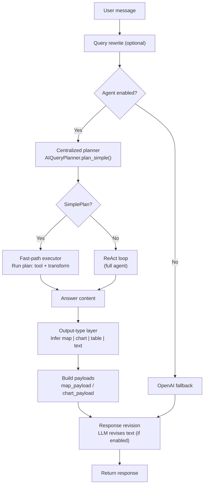

# AI Chat: System Architecture

This document describes the **current** Backoffice AI chat flow: how paths are chosen, how answers are produced, and how responses are formatted and revised.

---

## 1. Overview

The AI chat system:

- Answers user questions using **tools** (databank indicators, documents, assignments) when the agent is enabled.
- Uses a **centralized LLM planner** to decide whether a query can be solved with one tool (or one tool + minimal extraction); if so, it takes a **fast path**; otherwise it runs the full **ReAct** agent loop.
- Produces **answer content** (structured or prose) from either path, then an **output-type layer** infers map / chart / table / text and builds `map_payload` or `chart_payload` when appropriate.
- Runs **every** final response text through an **LLM revision** step for clarity and consistency (configurable).
- Falls back to a **direct OpenAI** chat (no tools) when the agent is disabled or the agent path fails.

---

## 2. High-level flow

**Paths in short**

| Path | When | Outcome |
|------|------|---------|
| **Fast path** | Planner returns a valid `SimplePlan` and the executor succeeds | Answer content from one (or one + extract) tool call. |
| **ReAct loop** | No plan, or fast path did not produce a result | Multi-step agent with tools; model writes final answer. |
| **OpenAI fallback** | Agent disabled or agent path failed | Single chat completion, no tools. |

**ReAct vs OpenAI fallback**

- **ReAct** = agent path: LLM is called **with tools** in a loop (Thought → Action → Observation → … → finish).
- **OpenAI fallback** = no-agent path: one chat completion **without tools**. So “ReAct” and “fallback” are different; both may use the same OpenAI model.

---

## 3. Path choice and execution

### 3.1 Entry

1. **Query rewrite** (optional, when `AI_QUERY_REWRITE_ENABLED`): user message is rewritten by an LLM before being used for planning and tools.
2. **Agent enabled?** From `AI_AGENT_ENABLED` and runtime (e.g. agent failure). If not enabled, the request goes to the OpenAI fallback.

### 3.2 Centralized planner

- **Service**: `app/services/ai_query_planner.py` — `AIQueryPlanner`, `SimplePlan`.
- **Role**: Single place for “can this query be solved with one tool (or one tool + minimal LLM)?”.
- **Input**: `(query, tool_names)`.
- **Output**: `Optional[SimplePlan]`. `None` → use ReAct.

**SimplePlan** (conceptual):

- `kind`: e.g. `single_value`, `timeseries`, `document_inventory`, `per_country_docs`, `unified_plans_focus`.
- `tool_name`: which tool to call.
- `tool_args`: arguments for that tool.
- `output_hint`: `map` | `chart` | `table` | `text`.

The planner uses an **LLM** to produce a JSON plan; the plan is **validated** (required args, confidence threshold, allowed tools). No query-type regex for “worldmap” or “chart”; intent is inferred by the model.

### 3.3 Fast path

- **Where**: `AIAgentExecutor._execute_simple_plan()` in `app/services/ai_agent_executor.py`.
- **Input**: `SimplePlan`, query, language, callback.
- **Behavior**: Run the planned tool; apply a simple transform depending on `plan.kind` (e.g. single value → one line; timeseries → chart payload + short text; document inventory → list; per_country_docs → one LLM extraction step then per-country list; `unified_plans_focus` → delegated fastpath service in `app/services/ai_fastpaths/unified_plans_focus_fastpath.py`).
- **Output**: Dict with `answer`, `answer_content`, `output_hint`, and optionally `map_payload` / `chart_payload`. If the executor does not produce a successful result, the run **falls back to ReAct**.

### 3.4 ReAct loop

- **When**: Planner returns `None`, or fast path ran but did not return a successful answer.
- **Where**: `_execute_openai_native()` or `_execute_custom_react()` in `ai_agent_executor.py`.
- **Behavior**: LLM in a loop with tools (Thought → Action → Observation) until the model outputs “finish” or limits (timeout, max tools, cost) are hit.

### 3.5 OpenAI fallback

- **When**: Agent disabled or agent path failed.
- **Behavior**: Single `chat.completions.create()` with system + history + user message; no tools. Response is then still passed through the **response revision** step when enabled.

---

## 4. Output-type layer

- **Where**: `app/services/ai_chat_engine.py` (after agent or OpenAI returns).
- **Inputs**: `answer_content`, `output_hint`, and any explicit `map_payload` / `chart_payload` from the agent.
- **Role**: If the agent did not provide a map/chart payload, infer one from normalized `answer_content` and `output_hint`:
  - **Map**: When `answer_content.kind` is `per_country_values` and `output_hint` suggests map, build `map_payload` from `rows` (iso3, value, label, optional year).
  - **Chart**: When `answer_content.kind` is `time_series` and `output_hint` suggests chart, build `chart_payload` from `series`.
- **Output**: Response text plus optional `map_payload` and `chart_payload` for the frontend to render.

Map and chart are **output formats** chosen from data shape and hint; there are no separate “worldmap query” or “chart query” branches in path choice.

---

## 5. Response revision

- **Where**: `_revise_response_with_llm()` in `app/services/ai_chat_engine.py`.
- **When**: After the final response text is known, for **all** successful responses (agent path, OpenAI streaming, OpenAI non-streaming). If revision is enabled and the text is non-empty, it is sent to the LLM once for clarity, tone, and consistency; the revised text is what the user sees.
- **Config**: `AI_RESPONSE_REVISION_ENABLED` (default `True`), `AI_RESPONSE_REVISION_MAX_TOKENS` (default `1500`).
- **Effect**: Every response (including fast-path templated answers) gets one LLM pass so wording is consistent and clearer.

---

## 6. Response types and content

### 6.1 What is returned

- **Text**: The main prose the user sees (always present when there is a response). After revision, this is the revised text.
- **Structured payloads**: `map_payload`, `chart_payload` (optional), built by the output-type layer or provided by the agent.
- **Answer content** (internal): Normalized shapes such as `single_value`, `time_series`, `per_country_values`, `documents`, `country_list`, or free-form from ReAct.

### 6.2 Where the initial text comes from (before revision)

| Path | Kind | How the initial answer text is produced |
|------|------|----------------------------------------|
| Fast path | `single_value` | One-line template: e.g. "**Country — Indicator:** value" |
| Fast path | `document_inventory` | "I found **N** document(s)." + numbered list |
| Fast path | `timeseries` | One-line template + chart payload |
| Fast path | `per_country_docs` | Short template (coverage/count) or country list sentence |
| Fast path | `unified_plans_focus` | Header + counts + markdown table + LLM synthesis (or table-only if synthesis fails) |
| ReAct | Any | Model writes the final answer from tool results |
| OpenAI fallback | — | Single chat completion |

**After this**, the **response revision** step runs on the final text (when enabled), so the user always sees an LLM-revised version for consistency and clarity.

---

## 7. Tools inventory

Tools are defined in `app/services/ai_tools_registry.py` and exposed to the agent via `get_tool_definitions_openai()` (subject to source selection: databank, system documents, UPR documents).

| Tool | Purpose | Parameters (main) |
|------|---------|-------------------|
| `get_indicator_value` | One indicator value for one country (databank) | country, indicator_name, period? |
| `get_indicator_timeseries` | Indicator over time for one country (databank) | country, indicator_name, limit_periods?, include_saved? |
| `get_indicator_values_for_all_countries` | One indicator for all countries (databank) | indicator_name, period?, min_value? |
| `get_indicator_metadata` | Indicator definition / metadata | indicator_name |
| `get_form_field_value` | Value for a form section/field (one country) | country, field_label_or_name, period?, assignment_period? |
| `get_assignment_indicator_values` | All indicator values in an assignment | country, template_identifier, period? |
| `get_user_assignments` | Form assignments for a country | country, status? |
| `get_country_information` | Country info (assignments, deadlines, activity) | country_identifier |
| `get_upr_kpi_value` | One UPR KPI for one country (from doc metadata) | country, metric (branches \| local_units \| volunteers \| staff) |
| `get_upr_kpi_timeseries` | UPR KPI over time for one country | country, metric |
| `get_upr_kpi_values_for_all_countries` | One UPR KPI for all countries | metric |
| `list_documents` | List documents by metadata | query?, country?, status?, file_type?, limit?, offset? |
| `search_documents` | Semantic/keyword search over document chunks | query, country?, top_k?, return_all_countries?, document_type? |
| `analyze_unified_plans_focus_areas` | Which Unified Plans mention focus areas (cash, CEA, livelihoods, social protection) | areas?, limit? |
| `compare_countries` | Compare one indicator across several countries | country_identifiers[], indicator_name, period? |
| `validate_against_guidelines` | Compare indicator value to guidelines from documents | country, indicator_name, guideline_query, period? |

The planner only proposes tools that are allowed for the fast path (e.g. single value, timeseries, list, search, unified plans analysis, compare, etc.); the rest are used by the ReAct loop when the model chooses them.

---

## 8. Where to change things

| Concern | Location |
|--------|----------|
| Entry, routing, output-type inference, response revision | `app/services/ai_chat_engine.py` |
| Planner (SimplePlan, LLM plan, validation) | `app/services/ai_query_planner.py` |
| Agent orchestration: path choice, fast-path execution, ReAct loop | `app/services/ai_agent_executor.py` |
| Agent prompt policy/system instructions | `app/services/ai_prompt_policy.py` |
| Tool routing heuristics (source/tool choice rules) | `app/services/ai_tool_routing_policy.py` |
| Payload inference (map/chart from tool outputs) | `app/services/ai_payload_inference.py` |
| Step/progress UX labels and detail text | `app/services/ai_step_ux.py` |
| Tool observation compaction for LLM context | `app/services/ai_tool_observation.py` |
| Response policy (table-intent heuristics, answer sanitization) | `app/services/ai_response_policy.py` |
| Query intent helpers (assignment/form intent, reasoning query builders) | `app/services/ai_query_intent_helpers.py` |
| Runtime utilities (cost estimation, partial-answer synthesis) | `app/services/ai_runtime_utils.py` |
| Dedicated unified-plans fast path | `app/services/ai_fastpaths/unified_plans_focus_fastpath.py` |
| Agent ↔ engine (process_query, meta) | `app/services/ai_chat_integration.py` |
| Tool definitions and execution | `app/services/ai_tools_registry.py` |
| AI config (revision, planner, agent, rewrite) | `config/config.py`, `env.example` |
| Progress UI (steps list, step_detail) | `app/static/js/chatbot.js` (`addStepToProgress`, `appendStepDetail`), `app/routes/ai.py` (`_on_step`, `_persist_inflight_update`) |

---

## 9. Progress steps (UX review)

Typical step sequence for an agent run:

1. **Preparing query…** — Emitted by chat engine before agent runs; detail can be refined query.
2. **Planning approach…** — Emitted by executor after `plan_simple()`. Detail is **user-facing only**: e.g. “Analyzing your question step by step.” (when no simple plan) or “Direct approach: &lt;step&gt;” (fast path). Technical details (e.g. “Using full ReAct (no simple plan).”) are logged only, not shown in the UI.
3. **Checking data…** / **Listing documents (query)** / **Searching documents (query)** — One step per tool call. Message/detail text are produced by `app/services/ai_step_ux.py` (`step_display_message`, `format_tool_args_detail`). Document search/list queries are normalized for display via `document_query_for_display`: e.g. "UPR:", "UPR" → "Unified Planning and Reporting"; "UPL-", "UPL" → "Unified Plans". UPR in this platform means **Unified Planning and Reporting**, not Universal Periodic Review.
4. **Reviewing results…** — Shown **between** tool runs when the model is deciding the next action; detail “Thinking what to do next.” So users do not think the final answer is coming yet.
5. **Drafting answer…** — Shown **only once**, when the agent has finished all tool calls and is about to return the final answer (no more “Reviewing results…” after this).

Notes:

- **Duplicate “Checking data” with different queries** — The model can call tools multiple times; each call produces one step. Step labels for document search/list use friendly names (Unified Planning and Reporting, Unified Plans) instead of raw fragments like "UPR:" or "UPL-".
- **Maps/lists of countries in a region (e.g. “UPR countries in MENA”)** — The agent must use bulk tools (get_upr_kpi_values_for_all_countries, get_indicator_values_for_all_countries, list_documents) and filter by region; it must NOT call get_country_information once per country.
- **RAG progress** — Long-running document search streams sub-details via `_progress_callback`; these are appended as `step_detail` to the current step in `chatbot.js`.

---

## Appendix: Legacy (before present system)

Previously, the system used **narrow fast paths** triggered by query-type logic (e.g. regex for “worldmap”, “heatmap”, “unified plans”). Path choice and output type were tied to those branches. The **present** system replaces that with:

- A **centralized LLM planner** for path choice (no query-type regex).
- A **generic fast-path executor** driven by `SimplePlan`.
- A **single output-type layer** that infers map/chart from `answer_content` and `output_hint`.
- **Response revision** so every response is run through the LLM for clarity.

The old “documents-only worldmap” and “Unified plans focus” branches were removed or folded into the generic planner and executor.
