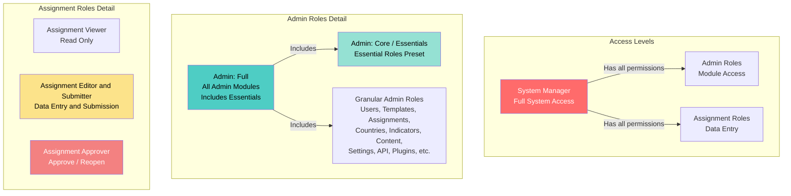

# أدوار المستخدم والصلاحيات

يشرح هذا الدليل أدوار المستخدم المختلفة في النظام ومتى تُعينها.

## نظرة عامة

يستخدم النظام نظام **التحكم في الوصول القائم على الأدوار (RBAC)** حيث يمكن للمستخدمين الحصول على أدوار متعددة. يمنح كل دور صلاحيات محددة لتنفيذ الإجراءات في النظام.

## فئات الأدوار

هناك ثلاث فئات رئيسية للأدوار:

1. **مدير النظام** - وصول المشرف الكامل
2. **أدوار المسؤول** - وصول إداري لوحدات محددة
3. **أدوار المهام** - لإدخال البيانات وإدارة المهام

## التسلسل الهرمي للأدوار

### علاقات الأدوار

- **مدير النظام** لديه جميع الصلاحيات من أدوار المسؤول والمهام
- **المسؤول: الكامل** هو إعداد مسبق يتضمن جميع أدوار وحدات المسؤول (باستثناء الإعدادات والإضافات)
- **المسؤول: الكامل** يتضمن إعداد **أساسيات المسؤول** المسبق بالإضافة إلى أدوار المسؤول الإضافية
- **المسؤول: الأساسي** (يُسمى أيضاً "أساسيات المسؤول") هو إعداد مسبق يتضمن أدوار المسؤول والمهام الأساسية
- **أساسيات المسؤول** تتضمن أدواراً متعددة مفصلة (المستخدمون، القوالب، المهام، الدول، المؤشرات، بالإضافة إلى جميع أدوار المهام)
- **أدوار المسؤول المفصلة** توفر وصولاً محدداً للوحدات (يمكن دمجها بشكل فردي أو عبر الإعدادات المسبقة)
- **أدوار المهام** مستقلة ويمكن دمجها مع أدوار المسؤول

## مدير النظام

**رمز الدور:** `system_manager`

**الوصف:** وصول كامل لجميع قدرات المنصة (مشرف).

**متى تستخدمه:**
- لمسؤولي تكنولوجيا المعلومات الذين يحتاجون إلى وصول كامل للنظام
- لمسؤولي النظام الذين يديرون بنية المنصة
- **استخدمه باعتدال** - عيّنه فقط للأشخاص الموثوقين الذين يحتاجون إلى تحكم كامل

**القدرات الرئيسية:**
- جميع صلاحيات المسؤول
- جميع صلاحيات المهام
- يمكنه تعيين أي دور لأي مستخدم
- يمكنه إدارة إعدادات النظام
- يمكنه الوصول إلى ميزات الأمان والتدقيق

## أدوار المسؤول

توفر أدوار المسؤول الوصول إلى الوظائف الإدارية. يمكن للمستخدمين الحصول على أدوار مسؤول متعددة.

### المسؤول: الكامل

**رمز الدور:** `admin_full`

**الوصف:** إعداد مسبق يتضمن جميع أدوار وحدات المسؤول (لا يمنح صلاحيات مدير النظام). هذا إعداد مسبق للراحة يختار تلقائياً أدوار مسؤول مفصلة متعددة.

**متى تستخدمه:**
- للمسؤولين الكبار الذين يحتاجون إلى وصول واسع
- للمسؤولين الذين يديرون مجالات متعددة
- بديل لاختيار العديد من أدوار المسؤول المفصلة يدوياً

**يتضمن:**
- جميع أدوار وحدات المسؤول (المستخدمون، القوالب، المهام، الدول، المؤشرات، المحتوى، التحليلات، التدقيق، مستكشف البيانات، الذكاء الاصطناعي، الإشعارات، الترجمات، واجهة برمجة التطبيقات)
- **يستثني:** الإعدادات والإضافات (يجب تعيينها بشكل منفصل)
- **يتضمن:** جميع الأدوار من إعداد أساسيات المسؤول المسبق (انظر أدناه)

**القدرات الرئيسية:**
- جميع صلاحيات وحدات المسؤول (باستثناء الإعدادات والإضافات)
- لا يمكنه تعيين دور مدير النظام
- لا يمكنه تنفيذ عمليات على مستوى النظام

**ملاحظة:** عندما تختار "المسؤول: الكامل"، يختار النظام تلقائياً جميع الأدوار المفصلة المضمنة. لا يزال بإمكانك التخصيص بإضافة أو إزالة الأدوار الفردية.

### المسؤول: الأساسي (الأساسيات)

**رمز الدور:** `admin_core`

**يُعرف أيضاً باسم:** أساسيات المسؤول

**الوصف:** إعداد مسبق يتضمن أدوار المسؤول والمهام الأساسية. هذا إعداد مسبق للراحة يختار تلقائياً أدواراً مفصلة متعددة للاحتياجات الإدارية الشائعة.

**متى تستخدمه:**
- للمسؤولين الذين يحتاجون إلى وصول إداري أساسي
- لأغراض الإبلاغ والمراقبة
- كإعداد مسبق أساسي مجتمع مع أدوار إضافية محددة

**يتضمن:**

**أدوار المسؤول:**
- المستخدمون: عرض وإدارة
- القوالب: عرض وإدارة
- المهام: عرض وإدارة
- الدول والمنظمة: عرض وإدارة
- بنك المؤشرات: عرض

**أدوار المهام:**
- عارض المهام
- محرر ومرسل المهام
- موافق المهام

**القدرات الرئيسية:**
- عرض وإدارة المستخدمين والقوالب والمهام والدول والمؤشرات
- وصول كامل لسير عمل المهام (عرض، تحرير، إرسال، موافقة)

**ملاحظة:** عندما تختار "أساسيات المسؤول"، يختار النظام تلقائياً جميع الأدوار المفصلة المضمنة. هذا الإعداد المسبق مُضمن في "المسؤول: الكامل" - اختيار الكامل سيختار أيضاً جميع أدوار الأساسيات.

### أدوار المسؤول المفصلة

توفر هذه الأدوار الوصول إلى وحدات المسؤول المحددة. عيّن أدواراً متعددة حسب الحاجة.

#### مسؤول: مدير المستخدمين
**رمز الدور:** `admin_users_manager`

**القدرات:**
- إنشاء وتحرير وتعطيل وحذف المستخدمين
- تعيين الأدوار للمستخدمين
- إدارة منح الوصول
- عرض وإدارة أجهزة المستخدم

**متى تستخدمه:** لمسؤولي الموارد البشرية أو مديري حسابات المستخدمين.

#### مسؤول: مدير القوالب
**رمز الدور:** `admin_templates_manager`

**القدرات:**
- إنشاء وتحرير وحذف القوالب
- نشر القوالب
- مشاركة القوالب
- استيراد/تصدير القوالب

**متى تستخدمه:** لمصممي النماذج ومسؤولي القوالب.

#### مسؤول: مدير المهام
**رمز الدور:** `admin_assignments_manager`

**القدرات:**
- إنشاء وتحرير وحذف المهام
- إدارة كيانات المهام (الدول/المنظمات)
- إدارة الإرسالات العامة

**متى تستخدمه:** للمسؤولين الذين يوزعون النماذج ويديرون جمع البيانات.

#### مسؤول: مدير الدول والمنظمة
**رمز الدور:** `admin_countries_manager`

**القدرات:**
- عرض وتحرير الدول
- إدارة هيكل المنظمة
- عرض والموافقة/الرفض على طلبات الوصول

**متى تستخدمه:** للمسؤولين الذين يديرون الهيكل التنظيمي.

#### مسؤول: مدير بنك المؤشرات
**رمز الدور:** `admin_indicator_bank_manager`

**القدرات:**
- عرض وإنشاء وتحرير وأرشفة المؤشرات
- مراجعة اقتراحات المؤشرات

**متى تستخدمه:** لمسؤولي معايير البيانات.

#### مسؤول: مدير المحتوى
**رمز الدور:** `admin_content_manager`

**القدرات:**
- إدارة الموارد
- إدارة المنشورات
- إدارة المستندات

**متى تستخدمه:** لمسؤولي المحتوى وأمناء المكتبات.

#### مسؤول: مدير الإعدادات
**رمز الدور:** `admin_settings_manager`

**القدرات:**
- إدارة إعدادات النظام

**متى تستخدمه:** لمسؤولي تكوين النظام.

#### مسؤول: مدير واجهة برمجة التطبيقات
**رمز الدور:** `admin_api_manager`

**القدرات:**
- إدارة مفاتيح واجهة برمجة التطبيقات
- إدارة إعدادات واجهة برمجة التطبيقات

**متى تستخدمه:** للمطورين ومسؤولي واجهة برمجة التطبيقات.

#### مسؤول: مدير الإضافات
**رمز الدور:** `admin_plugins_manager`

**القدرات:**
- إدارة الإضافات

**متى تستخدمه:** لمسؤولي النظام الذين يديرون الامتدادات.

#### مسؤول: مستكشف البيانات
**رمز الدور:** `admin_data_explorer`

**القدرات:**
- استخدام أدوات استكشاف البيانات

**متى تستخدمه:** لمحللي البيانات والباحثين.

#### مسؤول: عارض التحليلات
**رمز الدور:** `admin_analytics_viewer`

**القدرات:**
- عرض التحليلات

**متى تستخدمه:** لأغراض الإبلاغ والمراقبة.

#### مسؤول: عارض التدقيق
**رمز الدور:** `admin_audit_viewer`

**القدرات:**
- عرض سجل التدقيق

**متى تستخدمه:** للامتثال ومراقبة الأمان.

#### مسؤول: عارض/مستجيب الأمان
**رموز الدور:** `admin_security_viewer`، `admin_security_responder`

**القدرات:**
- عرض لوحة الأمان (العارض)
- الاستجابة لأحداث الأمان (المستجيب)

**متى تستخدمه:** لمسؤولي الأمان.

#### مسؤول: مدير الذكاء الاصطناعي
**رمز الدور:** `admin_ai_manager`

**القدرات:**
- إدارة نظام الذكاء الاصطناعي
- إدارة لوحة الذكاء الاصطناعي
- إدارة مكتبة المستندات
- عرض آثار التفكير

**متى تستخدمه:** لمسؤولي نظام الذكاء الاصطناعي.

#### مسؤول: مدير الإشعارات
**رمز الدور:** `admin_notifications_manager`

**القدرات:**
- عرض جميع الإشعارات
- إرسال الإشعارات

**متى تستخدمه:** لمسؤولي الاتصالات.

#### مسؤول: مدير الترجمات
**رمز الدور:** `admin_translations_manager`

**القدرات:**
- إدارة سلاسل الترجمة
- تجميع الترجمات
- إعادة تحميل الترجمات

**متى تستخدمه:** لمسؤولي المحتوى متعدد اللغات.

## أدوار المهام

هذه الأدوار للمستخدمين الذين يعملون مع المهام (إدخال البيانات، الإرسال، الموافقة).

### عارض المهام

**رمز الدور:** `assignment_viewer`

**الوصف:** وصول للقراءة فقط للمهام.

**متى تستخدمه:**
- للمستخدمين الذين يحتاجون إلى عرض المهام ولكن ليس التحرير
- لأغراض الإبلاغ
- مجتمع مع أدوار أخرى للوصول للقراءة فقط

**القدرات الرئيسية:**
- عرض المهام (للقراءة فقط)

### محرر ومرسل المهام

**رمز الدور:** `assignment_editor_submitter`

**الوصف:** يمكنه إدخال البيانات وإرسال المهام (لا توجد صلاحيات موافقة).

**متى تستخدمه:**
- **الدور الأساسي لنقاط الاتصال** - موظفو إدخال البيانات
- للمستخدمين الذين يملأون النماذج ويرسلون البيانات
- هذا هو الدور القياسي لنقاط الاتصال في الدول

**القدرات الرئيسية:**
- عرض المهام
- إدخال/تحرير بيانات المهام
- إرسال المهام
- رفع مستندات المهام

**ملاحظة:** يجب أيضاً تعيين المستخدمين الذين لديهم هذا الدور لدول/منظمات محددة لرؤية المهام لتلك الكيانات.

### موافق المهام

**رمز الدور:** `assignment_approver`

**الوصف:** يمكنه الموافقة على المهام وإعادة فتحها.

**متى تستخدمه:**
- للمشرفين الذين يراجعون ويوافقون على الإرسالات
- لموظفي مراقبة الجودة
- عادة ما يُجمع مع `assignment_viewer` أو `assignment_editor_submitter`

**القدرات الرئيسية:**
- عرض المهام
- الموافقة على المهام المُرسلة
- إعادة فتح المهام المُوافق عليها/المُرسلة

### رافع مستندات المهام

**رمز الدور:** `assignment_documents_uploader`

**الوصف:** رفع المستندات الداعمة المتعلقة بالمهام (لا يوجد إدخال بيانات أو إرسال).

**متى تستخدمه:**
- للمستخدمين الذين يحتاجون فقط إلى رفع المستندات الداعمة
- لموظفي إدارة المستندات

**القدرات الرئيسية:**
- عرض المهام
- رفع مستندات المهام

## مجموعات الأدوار الشائعة

### نقطة الاتصال القياسية
- **الأدوار:** `assignment_editor_submitter`
- **تعيين الدولة:** مطلوب (تعيين لدول محددة)
- **حالة الاستخدام:** نقاط الاتصال في الدول الذين يدخلون ويرسلون البيانات

### نقطة الاتصال الكبيرة (مع الموافقة)
- **الأدوار:** `assignment_editor_submitter`، `assignment_approver`
- **تعيين الدولة:** مطلوب
- **حالة الاستخدام:** نقاط الاتصال الذين يوافقون أيضاً على الإرسالات

### العارض للقراءة فقط
- **الأدوار:** `assignment_viewer`
- **تعيين الدولة:** اختياري
- **حالة الاستخدام:** المستخدمون الذين يحتاجون إلى عرض المهام ولكن ليس التحرير

### المسؤول المبتدئ
- **الأدوار:** `admin_core`، `admin_templates_viewer`، `admin_assignments_viewer`
- **حالة الاستخدام:** المسؤولون الجدد الذين يتعلمون النظام

### مسؤول المحتوى
- **الأدوار:** `admin_core`، `admin_content_manager`
- **حالة الاستخدام:** المسؤولون الذين يديرون الموارد والمنشورات

### المسؤول الكامل
- **الأدوار:** `admin_full` (إعداد مسبق يتضمن الأساسيات + جميع أدوار المسؤول الأخرى)
- **حالة الاستخدام:** المسؤولون ذوو الخبرة الذين يديرون مجالات متعددة
- **ملاحظة:** يتضمن إعداد `admin_full` تلقائياً جميع الأدوار من `admin_core` (الأساسيات) بالإضافة إلى أدوار المسؤول الإضافية

## أفضل الممارسات

### تعيين الأدوار

1. **مبدأ أقل امتياز:** عيّن فقط الأدوار التي يحتاجها المستخدمون لأداء واجباتهم
2. **ابدأ بالأساسي:** ابدأ بـ `admin_core` للمسؤولين الجدد، ثم أضف أدوار المدير المحددة
3. **اجمع الأدوار:** يمكن للمستخدمين الحصول على أدوار متعددة - اجمع الأدوار المفصلة للاحتياجات المحددة
4. **راجع بانتظام:** راجع أدوار المستخدمين بشكل دوري وأزل الصلاحيات غير الضرورية

### لنقاط الاتصال

1. **عيّن دائماً الدول:** يجب تعيين نقاط الاتصال لدول/منظمات محددة
2. **استخدم `assignment_editor_submitter`:** هذا هو الدور القياسي لإدخال البيانات
3. **أضف دور الموافق إن لزم الأمر:** فقط إذا كانوا يحتاجون إلى الموافقة على الإرسالات

### للمسؤولين

1. **تجنب مدير النظام:** عيّنه فقط لمسؤولي تكنولوجيا المعلومات/النظام
2. **استخدم الأدوار المفصلة:** يُفضل أدوار المدير المحددة على `admin_full` عند الإمكان
3. **اجمع مع الأساسي:** ابدأ بـ `admin_core` بالإضافة إلى أدوار المدير المحددة
4. **وثّق تعيينات الأدوار:** احتفظ بسجلات لسبب تعيين كل دور

## استكشاف الأخطاء

### المستخدم لا يرى المهام
- **تحقق:** المستخدم لديه دور `assignment_editor_submitter` أو `assignment_viewer`
- **تحقق:** المستخدم معين للدولة/المنظمة في المهمة

### المستخدم لا يمكنه الوصول إلى صفحات المسؤول
- **تحقق:** المستخدم لديه دور مسؤول واحد على الأقل (أي دور `admin_*`)
- **تحقق:** المستخدم لديه الصلاحية المحددة لتلك الصفحة

### المستخدم لا يمكنه تعيين الأدوار للآخرين
- **تحقق:** المستخدم لديه صلاحية `admin.users.roles.assign`
- **تحقق:** المستخدم لديه دور `admin_users_manager` أو دور `admin_full`
- **ملاحظة:** فقط مديرو النظام يمكنهم تعيين دور مدير النظام

### المستخدم لا يمكنه الموافقة على المهام
- **تحقق:** المستخدم لديه دور `assignment_approver`
- **تحقق:** المستخدم لديه وصول إلى المهمة (تعيين الدولة)

## ذات صلة

- [إضافة مستخدم جديد](add-user.md) - كيفية إنشاء المستخدمين وتعيين الأدوار
- [إدارة المستخدمين](manage-users.md) - كيفية تحديث أدوار المستخدمين
- [استكشاف أخطاء الوصول](troubleshooting-access.md) - مشاكل الوصول الشائعة
