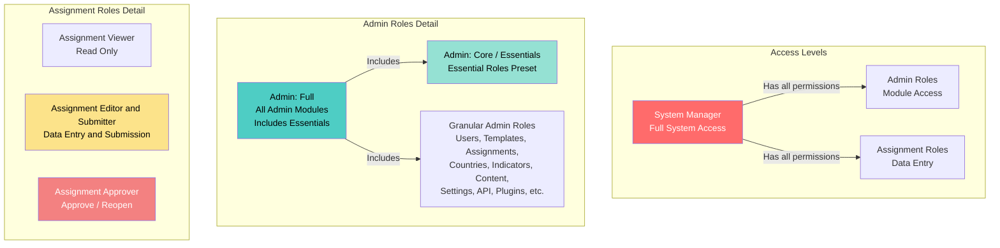

# Roles y permisos de usuario

Esta guía explica los diferentes roles de usuario en el sistema y cuándo asignarlos.

## Vista general

El sistema usa un sistema de **Control de acceso basado en roles (RBAC)** donde los usuarios pueden tener múltiples roles. Cada rol otorga permisos específicos para realizar acciones en el sistema.

## Categorías de roles

Hay tres categorías principales de roles:

1. **Gestor del sistema** - Acceso completo de superusuario
2. **Roles de administrador** - Acceso administrativo a módulos específicos
3. **Roles de asignación** - Para entrada de datos y gestión de asignaciones

## Jerarquía de roles

### Relaciones de roles

- **Gestor del sistema** tiene todos los permisos de los roles de Administrador y Asignación
- **Administrador: Completo** es un preajuste que incluye todos los roles de módulos de administración (excepto Configuración y Plugins)
- **Administrador: Completo** incluye el preajuste **Esenciales de administrador** más roles de administración adicionales
- **Administrador: Core** (también llamado "Esenciales de administrador") es un preajuste que incluye roles esenciales de administración y asignación
- **Esenciales de administrador** incluye múltiples roles granulares (Usuarios, Plantillas, Asignaciones, Países, Indicadores, más todos los roles de Asignación)
- **Roles de administración granulares** proporcionan acceso a módulos específicos (se pueden combinar individualmente o mediante preajustes)
- **Roles de asignación** son independientes y se pueden combinar con roles de administración

## Gestor del sistema

**Código de rol:** `system_manager`

**Descripción:** Acceso completo a todas las capacidades de la plataforma (superusuario).

**Cuándo usar:**
- Para administradores de TI que necesitan acceso completo al sistema
- Para administradores del sistema que gestionan la infraestructura de la plataforma
- **Usa con moderación** - solo asigna a personal de confianza que necesita control total

**Capacidades clave:**
- Todos los permisos de administración
- Todos los permisos de asignación
- Puede asignar cualquier rol a cualquier usuario
- Puede gestionar configuraciones del sistema
- Puede acceder a funciones de seguridad y auditoría

## Roles de administrador

Los roles de administrador proporcionan acceso a funciones administrativas. Los usuarios pueden tener múltiples roles de administración.

### Administrador: Completo

**Código de rol:** `admin_full`

**Descripción:** Un preajuste que incluye todos los roles de módulos de administración (no otorga poderes de Gestor del sistema). Este es un preajuste de conveniencia que selecciona automáticamente múltiples roles de administración granulares.

**Cuándo usar:**
- Para administradores senior que necesitan acceso amplio
- Para administradores que gestionan múltiples áreas
- Alternativa a seleccionar manualmente muchos roles de administración granulares

**Incluye:**
- Todos los roles de módulos de administración (Usuarios, Plantillas, Asignaciones, Países, Indicadores, Contenido, Analíticas, Auditoría, Explorador de datos, IA, Notificaciones, Traducciones, API)
- **Excluye:** Configuración y Plugins (estos deben asignarse por separado)
- **Incluye:** Todos los roles del preajuste Esenciales de administrador (ver abajo)

**Capacidades clave:**
- Todos los permisos de módulos de administración (excepto Configuración y Plugins)
- No puede asignar el rol de Gestor del sistema
- No puede realizar operaciones a nivel del sistema

**Nota:** Cuando seleccionas "Administrador: Completo", el sistema selecciona automáticamente todos los roles granulares incluidos. Aún puedes personalizar agregando o eliminando roles individuales.

### Administrador: Core (Esenciales)

**Código de rol:** `admin_core`

**También conocido como:** Esenciales de administrador

**Descripción:** Un preajuste que incluye roles esenciales de administración y asignación. Este es un preajuste de conveniencia que selecciona automáticamente múltiples roles granulares para necesidades administrativas comunes.

**Cuándo usar:**
- Para administradores que necesitan acceso administrativo esencial
- Para propósitos de reportes y monitoreo
- Como preajuste base combinado con roles adicionales específicos

**Incluye:**

**Roles de administración:**
- Usuarios: Ver y Gestionar
- Plantillas: Ver y Gestionar
- Asignaciones: Ver y Gestionar
- Países y Organización: Ver y Gestionar
- Banco de indicadores: Ver

**Roles de asignación:**
- Visualizador de asignaciones
- Editor y remitente de asignaciones
- Aprobador de asignaciones

**Capacidades clave:**
- Ver y gestionar usuarios, plantillas, asignaciones, países e indicadores
- Acceso completo al flujo de trabajo de asignaciones (ver, editar, enviar, aprobar)

**Nota:** Cuando seleccionas "Esenciales de administrador", el sistema selecciona automáticamente todos los roles granulares incluidos. Este preajuste está incluido dentro de "Administrador: Completo" - seleccionar Completo también seleccionará todos los roles Esenciales.

### Roles de administración granulares

Estos roles proporcionan acceso a módulos de administración específicos. Asigna múltiples roles según sea necesario.

#### Administrador: Gestor de usuarios
**Código de rol:** `admin_users_manager`

**Capacidades:**
- Crear, editar, desactivar y eliminar usuarios
- Asignar roles a usuarios
- Gestionar concesiones de acceso
- Ver y gestionar dispositivos de usuario

**Cuándo usar:** Para administradores de RRHH o gestores de cuentas de usuario.

#### Administrador: Gestor de plantillas
**Código de rol:** `admin_templates_manager`

**Capacidades:**
- Crear, editar y eliminar plantillas
- Publicar plantillas
- Compartir plantillas
- Importar/exportar plantillas

**Cuándo usar:** Para diseñadores de formularios y administradores de plantillas.

#### Administrador: Gestor de asignaciones
**Código de rol:** `admin_assignments_manager`

**Capacidades:**
- Crear, editar y eliminar asignaciones
- Gestionar entidades de asignación (países/organizaciones)
- Gestionar envíos públicos

**Cuándo usar:** Para administradores que distribuyen formularios y gestionan la recopilación de datos.

#### Administrador: Gestor de países y organización
**Código de rol:** `admin_countries_manager`

**Capacidades:**
- Ver y editar países
- Gestionar estructura organizacional
- Ver y aprobar/rechazar solicitudes de acceso

**Cuándo usar:** Para administradores que gestionan la estructura organizacional.

#### Administrador: Gestor del banco de indicadores
**Código de rol:** `admin_indicator_bank_manager`

**Capacidades:**
- Ver, crear, editar y archivar indicadores
- Revisar sugerencias de indicadores

**Cuándo usar:** Para administradores de estándares de datos.

#### Administrador: Gestor de contenido
**Código de rol:** `admin_content_manager`

**Capacidades:**
- Gestionar recursos
- Gestionar publicaciones
- Gestionar documentos

**Cuándo usar:** Para administradores de contenido y bibliotecarios.

#### Administrador: Gestor de configuración
**Código de rol:** `admin_settings_manager`

**Capacidades:**
- Gestionar configuraciones del sistema

**Cuándo usar:** Para administradores de configuración del sistema.

#### Administrador: Gestor de API
**Código de rol:** `admin_api_manager`

**Capacidades:**
- Gestionar claves API
- Gestionar configuraciones API

**Cuándo usar:** Para desarrolladores y administradores de API.

#### Administrador: Gestor de plugins
**Código de rol:** `admin_plugins_manager`

**Capacidades:**
- Gestionar plugins

**Cuándo usar:** Para administradores del sistema que gestionan extensiones.

#### Administrador: Explorador de datos
**Código de rol:** `admin_data_explorer`

**Capacidades:**
- Usar herramientas de exploración de datos

**Cuándo usar:** Para analistas de datos e investigadores.

#### Administrador: Visualizador de analíticas
**Código de rol:** `admin_analytics_viewer`

**Capacidades:**
- Ver analíticas

**Cuándo usar:** Para propósitos de reportes y monitoreo.

#### Administrador: Visualizador de auditoría
**Código de rol:** `admin_audit_viewer`

**Capacidades:**
- Ver rastro de auditoría

**Cuándo usar:** Para cumplimiento y monitoreo de seguridad.

#### Administrador: Visualizador/Respondedor de seguridad
**Códigos de rol:** `admin_security_viewer`, `admin_security_responder`

**Capacidades:**
- Ver panel de seguridad (Visualizador)
- Responder a eventos de seguridad (Respondedor)

**Cuándo usar:** Para administradores de seguridad.

#### Administrador: Gestor de IA
**Código de rol:** `admin_ai_manager`

**Capacidades:**
- Gestionar sistema de IA
- Gestionar panel de IA
- Gestionar biblioteca de documentos
- Ver rastros de razonamiento

**Cuándo usar:** Para administradores de sistemas de IA.

#### Administrador: Gestor de notificaciones
**Código de rol:** `admin_notifications_manager`

**Capacidades:**
- Ver todas las notificaciones
- Enviar notificaciones

**Cuándo usar:** Para administradores de comunicaciones.

#### Administrador: Gestor de traducciones
**Código de rol:** `admin_translations_manager`

**Capacidades:**
- Gestionar cadenas de traducción
- Compilar traducciones
- Recargar traducciones

**Cuándo usar:** Para administradores de contenido multilingüe.

## Roles de asignación

Estos roles son para usuarios que trabajan con asignaciones (entrada de datos, envío, aprobación).

### Visualizador de asignaciones

**Código de rol:** `assignment_viewer`

**Descripción:** Acceso de solo lectura a asignaciones.

**Cuándo usar:**
- Para usuarios que necesitan ver asignaciones pero no editar
- Para propósitos de reportes
- Combinado con otros roles para acceso de solo lectura

**Capacidades clave:**
- Ver asignaciones (solo lectura)

### Editor y remitente de asignaciones

**Código de rol:** `assignment_editor_submitter`

**Descripción:** Puede ingresar datos y enviar asignaciones (sin poderes de aprobación).

**Cuándo usar:**
- **Rol principal para puntos focales** - personal de entrada de datos
- Para usuarios que completan formularios y envían datos
- Este es el rol estándar para puntos focales de países

**Capacidades clave:**
- Ver asignaciones
- Ingresar/editar datos de asignación
- Enviar asignaciones
- Cargar documentos de asignación

**Nota:** Los usuarios con este rol también deben estar asignados a países/organizaciones específicos para ver asignaciones para esas entidades.

### Aprobador de asignaciones

**Código de rol:** `assignment_approver`

**Descripción:** Puede aprobar y reabrir asignaciones.

**Cuándo usar:**
- Para supervisores que revisan y aprueban envíos
- Para personal de control de calidad
- Típicamente combinado con `assignment_viewer` o `assignment_editor_submitter`

**Capacidades clave:**
- Ver asignaciones
- Aprobar asignaciones enviadas
- Reabrir asignaciones aprobadas/enviadas

### Cargador de documentos de asignación

**Código de rol:** `assignment_documents_uploader`

**Descripción:** Cargar documentos de respaldo relacionados con asignaciones (sin entrada de datos o envío).

**Cuándo usar:**
- Para usuarios que solo necesitan cargar documentos de respaldo
- Para personal de gestión de documentos

**Capacidades clave:**
- Ver asignaciones
- Cargar documentos de asignación

## Combinaciones de roles comunes

### Punto focal estándar
- **Roles:** `assignment_editor_submitter`
- **Asignación de país:** Requerida (asignar a países específicos)
- **Caso de uso:** Puntos focales de países que ingresan y envían datos

### Punto focal senior (con aprobación)
- **Roles:** `assignment_editor_submitter`, `assignment_approver`
- **Asignación de país:** Requerida
- **Caso de uso:** Puntos focales que también aprueban envíos

### Visualizador de solo lectura
- **Roles:** `assignment_viewer`
- **Asignación de país:** Opcional
- **Caso de uso:** Usuarios que necesitan ver asignaciones pero no editar

### Administrador junior
- **Roles:** `admin_core`, `admin_templates_viewer`, `admin_assignments_viewer`
- **Caso de uso:** Nuevos administradores aprendiendo el sistema

### Administrador de contenido
- **Roles:** `admin_core`, `admin_content_manager`
- **Caso de uso:** Administradores que gestionan recursos y publicaciones

### Administrador completo
- **Roles:** `admin_full` (preajuste que incluye Esenciales + todos los demás roles de administración)
- **Caso de uso:** Administradores experimentados que gestionan múltiples áreas
- **Nota:** El preajuste `admin_full` incluye automáticamente todos los roles de `admin_core` (Esenciales) más roles de administración adicionales

## Mejores prácticas

### Asignación de roles

1. **Principio de menor privilegio:** Asigna solo los roles que los usuarios necesitan para realizar sus deberes
2. **Comienza con Core:** Comienza con `admin_core` para nuevos administradores, luego agrega roles de gestión específicos
3. **Combina roles:** Los usuarios pueden tener múltiples roles - combina roles granulares para necesidades específicas
4. **Revisa regularmente:** Revisa periódicamente los roles de usuario y elimina permisos innecesarios

### Para puntos focales

1. **Siempre asigna países:** Los puntos focales deben estar asignados a países/organizaciones específicos
2. **Usa `assignment_editor_submitter`:** Este es el rol estándar para entrada de datos
3. **Agrega rol de aprobador si es necesario:** Solo si necesitan aprobar envíos

### Para administradores

1. **Evita Gestor del sistema:** Solo asigna a administradores de TI/sistema
2. **Usa roles granulares:** Prefiere roles de gestión específicos sobre `admin_full` cuando sea posible
3. **Combina con Core:** Comienza con `admin_core` más roles de gestión específicos
4. **Documenta asignaciones de roles:** Mantén registros de por qué se asignó cada rol

## Solución de problemas

### El usuario no puede ver asignaciones
- **Verifica:** El usuario tiene el rol `assignment_editor_submitter` o `assignment_viewer`
- **Verifica:** El usuario está asignado al país/organización en la asignación

### El usuario no puede acceder a páginas de administración
- **Verifica:** El usuario tiene al menos un rol de administración (cualquier rol `admin_*`)
- **Verifica:** El usuario tiene el permiso específico para esa página

### El usuario no puede asignar roles a otros
- **Verifica:** El usuario tiene el permiso `admin.users.roles.assign`
- **Verifica:** El usuario tiene el rol `admin_users_manager` o `admin_full`
- **Nota:** Solo los Gestores del sistema pueden asignar el rol de Gestor del sistema

### El usuario no puede aprobar asignaciones
- **Verifica:** El usuario tiene el rol `assignment_approver`
- **Verifica:** El usuario tiene acceso a la asignación (asignación de país)

## Relacionado

- [Agregar nuevo usuario](add-user.md) - Cómo crear usuarios y asignar roles
- [Gestionar usuarios](manage-users.md) - Cómo actualizar roles de usuario
- [Solución de problemas de acceso](troubleshooting-access.md) - Problemas de acceso comunes
