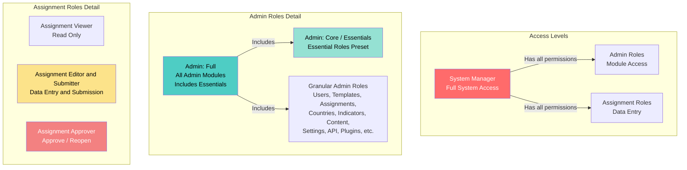

# Rôles et permissions utilisateur

Ce guide explique les différents rôles utilisateur dans le système et quand les assigner.

## Vue d'ensemble

Le système utilise un système de **Contrôle d'accès basé sur les rôles (RBAC)** où les utilisateurs peuvent avoir plusieurs rôles. Chaque rôle accorde des permissions spécifiques pour effectuer des actions dans le système.

## Catégories de rôles

Il existe trois catégories principales de rôles :

1. **Gestionnaire système** - Accès superutilisateur complet
2. **Rôles d'administrateur** - Accès administratif à des modules spécifiques
3. **Rôles de mission** - Pour la saisie de données et la gestion des missions

## Hiérarchie des rôles

### Relations entre les rôles

- **Gestionnaire système** a toutes les permissions des rôles Administrateur et Mission
- **Administrateur : Complet** est un préréglage qui inclut tous les rôles de modules d'administration (sauf Paramètres et Plugins)
- **Administrateur : Complet** inclut le préréglage **Essentiels administrateur** plus des rôles d'administration supplémentaires
- **Administrateur : Core** (également appelé "Essentiels administrateur") est un préréglage qui inclut les rôles essentiels d'administration et de mission
- **Essentiels administrateur** inclut plusieurs rôles granulaires (Utilisateurs, Modèles, Missions, Pays, Indicateurs, plus tous les rôles de Mission)
- **Rôles d'administration granulaires** fournissent un accès à des modules spécifiques (peuvent être combinés individuellement ou via des préréglages)
- **Rôles de mission** sont indépendants et peuvent être combinés avec les rôles d'administration

## Gestionnaire système

**Code de rôle :** `system_manager`

**Description :** Accès complet à toutes les capacités de la plateforme (superutilisateur).

**Quand l'utiliser :**
- Pour les administrateurs informatiques qui ont besoin d'un accès système complet
- Pour les administrateurs système qui gèrent l'infrastructure de la plateforme
- **Utilisez avec parcimonie** - assignez uniquement au personnel de confiance qui a besoin d'un contrôle total

**Capacités clés :**
- Toutes les permissions d'administration
- Toutes les permissions de mission
- Peut assigner n'importe quel rôle à n'importe quel utilisateur
- Peut gérer les paramètres système
- Peut accéder aux fonctionnalités de sécurité et d'audit

## Rôles d'administrateur

Les rôles d'administrateur fournissent l'accès aux fonctions administratives. Les utilisateurs peuvent avoir plusieurs rôles d'administration.

### Administrateur : Complet

**Code de rôle :** `admin_full`

**Description :** Un préréglage qui inclut tous les rôles de modules d'administration (n'accorde pas les pouvoirs de Gestionnaire système). C'est un préréglage pratique qui sélectionne automatiquement plusieurs rôles d'administration granulaires.

**Quand l'utiliser :**
- Pour les administrateurs seniors qui ont besoin d'un accès large
- Pour les administrateurs qui gèrent plusieurs domaines
- Alternative à la sélection manuelle de nombreux rôles d'administration granulaires

**Inclut :**
- Tous les rôles de modules d'administration (Utilisateurs, Modèles, Missions, Pays, Indicateurs, Contenu, Analytiques, Audit, Explorateur de données, IA, Notifications, Traductions, API)
- **Exclut :** Paramètres et Plugins (ceux-ci doivent être assignés séparément)
- **Inclut :** Tous les rôles du préréglage Essentiels administrateur (voir ci-dessous)

**Capacités clés :**
- Toutes les permissions de modules d'administration (sauf Paramètres et Plugins)
- Ne peut pas assigner le rôle Gestionnaire système
- Ne peut pas effectuer d'opérations au niveau système

**Note :** Lorsque vous sélectionnez "Administrateur : Complet", le système sélectionne automatiquement tous les rôles granulaires inclus. Vous pouvez toujours personnaliser en ajoutant ou supprimant des rôles individuels.

### Administrateur : Core (Essentiels)

**Code de rôle :** `admin_core`

**Également connu sous le nom de :** Essentiels administrateur

**Description :** Un préréglage qui inclut les rôles essentiels d'administration et de mission. C'est un préréglage pratique qui sélectionne automatiquement plusieurs rôles granulaires pour les besoins administratifs courants.

**Quand l'utiliser :**
- Pour les administrateurs qui ont besoin d'un accès administratif essentiel
- À des fins de reporting et de surveillance
- Comme préréglage de base combiné avec des rôles supplémentaires spécifiques

**Inclut :**

**Rôles d'administration :**
- Utilisateurs : Voir et Gérer
- Modèles : Voir et Gérer
- Missions : Voir et Gérer
- Pays et Organisation : Voir et Gérer
- Banque d'indicateurs : Voir

**Rôles de mission :**
- Visualiseur de mission
- Éditeur et soumetteur de mission
- Approbateur de mission

**Capacités clés :**
- Voir et gérer les utilisateurs, modèles, missions, pays et indicateurs
- Accès complet au flux de travail des missions (voir, modifier, soumettre, approuver)

**Note :** Lorsque vous sélectionnez "Essentiels administrateur", le système sélectionne automatiquement tous les rôles granulaires inclus. Ce préréglage est inclus dans "Administrateur : Complet" - sélectionner Complet sélectionnera également tous les rôles Essentiels.

### Rôles d'administration granulaires

Ces rôles fournissent l'accès à des modules d'administration spécifiques. Assignez plusieurs rôles selon les besoins.

#### Administrateur : Gestionnaire d'utilisateurs
**Code de rôle :** `admin_users_manager`

**Capacités :**
- Créer, modifier, désactiver et supprimer des utilisateurs
- Assigner des rôles aux utilisateurs
- Gérer les octrois d'accès
- Voir et gérer les appareils utilisateur

**Quand l'utiliser :** Pour les administrateurs RH ou les gestionnaires de comptes utilisateur.

#### Administrateur : Gestionnaire de modèles
**Code de rôle :** `admin_templates_manager`

**Capacités :**
- Créer, modifier et supprimer des modèles
- Publier des modèles
- Partager des modèles
- Importer/exporter des modèles

**Quand l'utiliser :** Pour les concepteurs de formulaires et les administrateurs de modèles.

#### Administrateur : Gestionnaire de missions
**Code de rôle :** `admin_assignments_manager`

**Capacités :**
- Créer, modifier et supprimer des missions
- Gérer les entités de mission (pays/organisations)
- Gérer les soumissions publiques

**Quand l'utiliser :** Pour les administrateurs qui distribuent des formulaires et gèrent la collecte de données.

#### Administrateur : Gestionnaire de pays et organisation
**Code de rôle :** `admin_countries_manager`

**Capacités :**
- Voir et modifier les pays
- Gérer la structure organisationnelle
- Voir et approuver/rejeter les demandes d'accès

**Quand l'utiliser :** Pour les administrateurs qui gèrent la structure organisationnelle.

#### Administrateur : Gestionnaire de banque d'indicateurs
**Code de rôle :** `admin_indicator_bank_manager`

**Capacités :**
- Voir, créer, modifier et archiver des indicateurs
- Examiner les suggestions d'indicateurs

**Quand l'utiliser :** Pour les administrateurs de normes de données.

#### Administrateur : Gestionnaire de contenu
**Code de rôle :** `admin_content_manager`

**Capacités :**
- Gérer les ressources
- Gérer les publications
- Gérer les documents

**Quand l'utiliser :** Pour les administrateurs de contenu et les bibliothécaires.

#### Administrateur : Gestionnaire de paramètres
**Code de rôle :** `admin_settings_manager`

**Capacités :**
- Gérer les paramètres système

**Quand l'utiliser :** Pour les administrateurs de configuration système.

#### Administrateur : Gestionnaire API
**Code de rôle :** `admin_api_manager`

**Capacités :**
- Gérer les clés API
- Gérer les paramètres API

**Quand l'utiliser :** Pour les développeurs et les administrateurs API.

#### Administrateur : Gestionnaire de plugins
**Code de rôle :** `admin_plugins_manager`

**Capacités :**
- Gérer les plugins

**Quand l'utiliser :** Pour les administrateurs système qui gèrent les extensions.

#### Administrateur : Explorateur de données
**Code de rôle :** `admin_data_explorer`

**Capacités :**
- Utiliser les outils d'exploration de données

**Quand l'utiliser :** Pour les analystes de données et les chercheurs.

#### Administrateur : Visualiseur d'analytiques
**Code de rôle :** `admin_analytics_viewer`

**Capacités :**
- Voir les analytiques

**Quand l'utiliser :** À des fins de reporting et de surveillance.

#### Administrateur : Visualiseur d'audit
**Code de rôle :** `admin_audit_viewer`

**Capacités :**
- Voir la piste d'audit

**Quand l'utiliser :** Pour la conformité et la surveillance de la sécurité.

#### Administrateur : Visualiseur/Répondeur de sécurité
**Codes de rôle :** `admin_security_viewer`, `admin_security_responder`

**Capacités :**
- Voir le tableau de bord de sécurité (Visualiseur)
- Répondre aux événements de sécurité (Répondeur)

**Quand l'utiliser :** Pour les administrateurs de sécurité.

#### Administrateur : Gestionnaire IA
**Code de rôle :** `admin_ai_manager`

**Capacités :**
- Gérer le système IA
- Gérer le tableau de bord IA
- Gérer la bibliothèque de documents
- Voir les traces de raisonnement

**Quand l'utiliser :** Pour les administrateurs de système IA.

#### Administrateur : Gestionnaire de notifications
**Code de rôle :** `admin_notifications_manager`

**Capacités :**
- Voir toutes les notifications
- Envoyer des notifications

**Quand l'utiliser :** Pour les administrateurs de communication.

#### Administrateur : Gestionnaire de traductions
**Code de rôle :** `admin_translations_manager`

**Capacités :**
- Gérer les chaînes de traduction
- Compiler les traductions
- Recharger les traductions

**Quand l'utiliser :** Pour les administrateurs de contenu multilingue.

## Rôles de mission

Ces rôles sont pour les utilisateurs qui travaillent avec les missions (saisie de données, soumission, approbation).

### Visualiseur de mission

**Code de rôle :** `assignment_viewer`

**Description :** Accès en lecture seule aux missions.

**Quand l'utiliser :**
- Pour les utilisateurs qui ont besoin de voir les missions mais pas de les modifier
- À des fins de reporting
- Combiné avec d'autres rôles pour un accès en lecture seule

**Capacités clés :**
- Voir les missions (lecture seule)

### Éditeur et soumetteur de mission

**Code de rôle :** `assignment_editor_submitter`

**Description :** Peut saisir des données et soumettre des missions (pas de pouvoirs d'approbation).

**Quand l'utiliser :**
- **Rôle principal pour les points focaux** - personnel de saisie de données
- Pour les utilisateurs qui remplissent des formulaires et soumettent des données
- C'est le rôle standard pour les points focaux de pays

**Capacités clés :**
- Voir les missions
- Saisir/modifier les données de mission
- Soumettre des missions
- Télécharger des documents de mission

**Note :** Les utilisateurs avec ce rôle doivent également être assignés à des pays/organisations spécifiques pour voir les missions pour ces entités.

### Approbateur de mission

**Code de rôle :** `assignment_approver`

**Description :** Peut approuver et rouvrir les missions.

**Quand l'utiliser :**
- Pour les superviseurs qui examinent et approuvent les soumissions
- Pour le personnel de contrôle qualité
- Généralement combiné avec `assignment_viewer` ou `assignment_editor_submitter`

**Capacités clés :**
- Voir les missions
- Approuver les missions soumises
- Rouvrir les missions approuvées/soumises

### Téléchargeur de documents de mission

**Code de rôle :** `assignment_documents_uploader`

**Description :** Télécharger des documents justificatifs liés aux missions (pas de saisie de données ou de soumission).

**Quand l'utiliser :**
- Pour les utilisateurs qui ont seulement besoin de télécharger des documents justificatifs
- Pour le personnel de gestion de documents

**Capacités clés :**
- Voir les missions
- Télécharger des documents de mission

## Combinaisons de rôles courantes

### Point focal standard
- **Rôles :** `assignment_editor_submitter`
- **Assignation de pays :** Requis (assigner à des pays spécifiques)
- **Cas d'utilisation :** Points focaux de pays qui saisissent et soumettent des données

### Point focal senior (avec approbation)
- **Rôles :** `assignment_editor_submitter`, `assignment_approver`
- **Assignation de pays :** Requis
- **Cas d'utilisation :** Points focaux qui approuvent également les soumissions

### Visualiseur en lecture seule
- **Rôles :** `assignment_viewer`
- **Assignation de pays :** Optionnel
- **Cas d'utilisation :** Utilisateurs qui ont besoin de voir les missions mais pas de les modifier

### Administrateur junior
- **Rôles :** `admin_core`, `admin_templates_viewer`, `admin_assignments_viewer`
- **Cas d'utilisation :** Nouveaux administrateurs apprenant le système

### Administrateur de contenu
- **Rôles :** `admin_core`, `admin_content_manager`
- **Cas d'utilisation :** Administrateurs qui gèrent les ressources et les publications

### Administrateur complet
- **Rôles :** `admin_full` (préréglage qui inclut Essentiels + tous les autres rôles d'administration)
- **Cas d'utilisation :** Administrateurs expérimentés qui gèrent plusieurs domaines
- **Note :** Le préréglage `admin_full` inclut automatiquement tous les rôles de `admin_core` (Essentiels) plus des rôles d'administration supplémentaires

## Meilleures pratiques

### Assignation de rôles

1. **Principe du moindre privilège :** Assignez uniquement les rôles dont les utilisateurs ont besoin pour effectuer leurs fonctions
2. **Commencez par Core :** Commencez avec `admin_core` pour les nouveaux administrateurs, puis ajoutez des rôles de gestionnaire spécifiques
3. **Combinez les rôles :** Les utilisateurs peuvent avoir plusieurs rôles - combinez les rôles granulaires pour des besoins spécifiques
4. **Examinez régulièrement :** Examinez périodiquement les rôles utilisateur et supprimez les permissions inutiles

### Pour les points focaux

1. **Assignez toujours des pays :** Les points focaux doivent être assignés à des pays/organisations spécifiques
2. **Utilisez `assignment_editor_submitter` :** C'est le rôle standard pour la saisie de données
3. **Ajoutez le rôle d'approbateur si nécessaire :** Seulement s'ils ont besoin d'approuver les soumissions

### Pour les administrateurs

1. **Évitez Gestionnaire système :** Assignez uniquement aux administrateurs informatique/système
2. **Utilisez des rôles granulaires :** Préférez les rôles de gestionnaire spécifiques à `admin_full` lorsque c'est possible
3. **Combinez avec Core :** Commencez avec `admin_core` plus des rôles de gestionnaire spécifiques
4. **Documentez les assignations de rôles :** Gardez des enregistrements de pourquoi chaque rôle a été assigné

## Dépannage

### L'utilisateur ne peut pas voir les missions
- **Vérifiez :** L'utilisateur a le rôle `assignment_editor_submitter` ou `assignment_viewer`
- **Vérifiez :** L'utilisateur est assigné au pays/organisation dans la mission

### L'utilisateur ne peut pas accéder aux pages d'administration
- **Vérifiez :** L'utilisateur a au moins un rôle d'administration (n'importe quel rôle `admin_*`)
- **Vérifiez :** L'utilisateur a la permission spécifique pour cette page

### L'utilisateur ne peut pas assigner de rôles à d'autres
- **Vérifiez :** L'utilisateur a la permission `admin.users.roles.assign`
- **Vérifiez :** L'utilisateur a le rôle `admin_users_manager` ou `admin_full`
- **Note :** Seuls les Gestionnaires système peuvent assigner le rôle Gestionnaire système

### L'utilisateur ne peut pas approuver les missions
- **Vérifiez :** L'utilisateur a le rôle `assignment_approver`
- **Vérifiez :** L'utilisateur a accès à la mission (assignation de pays)

## Liens connexes

- [Ajouter un nouvel utilisateur](add-user.md) - Comment créer des utilisateurs et assigner des rôles
- [Gérer les utilisateurs](manage-users.md) - Comment mettre à jour les rôles utilisateur
- [Dépannage d'accès](troubleshooting-access.md) - Problèmes d'accès courants
