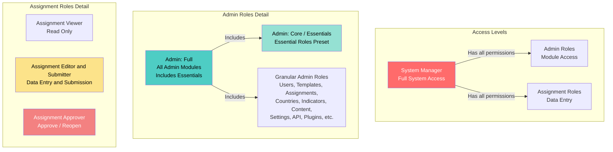

# User Roles and Permissions

This guide explains the different user roles in the system and when to assign them.

## Overview

The system uses a **Role-Based Access Control (RBAC)** system where users can have multiple roles. Each role grants specific permissions to perform actions in the system.

## Role Categories

There are three main categories of roles:

1. **System Manager** - Full superuser access
2. **Admin Roles** - Administrative access to specific modules
3. **Assignment Roles** - For data entry and assignment management

## Role Hierarchy

### Role Relationships

- **System Manager** has all permissions from both Admin and Assignment roles
- **Admin: Full** is a preset that includes all admin module roles (except Settings and Plugins)
- **Admin: Full** includes the **Admin Essentials** preset plus additional admin roles
- **Admin: Core** (also called "Admin Essentials") is a preset that includes essential admin and assignment roles
- **Admin Essentials** includes multiple granular roles (Users, Templates, Assignments, Countries, Indicators, plus all Assignment roles)
- **Granular Admin Roles** provide specific module access (can be combined individually or via presets)
- **Assignment Roles** are independent and can be combined with admin roles

## System Manager

**Role Code:** `system_manager`

**Description:** Full access to all platform capabilities (superuser).

**When to use:**
- For IT administrators who need complete system access
- For system administrators who manage the platform infrastructure
- **Use sparingly** - only assign to trusted personnel who need full control

**Key Capabilities:**
- All admin permissions
- All assignment permissions
- Can assign any role to any user
- Can manage system settings
- Can access security and audit features

## Admin Roles

Admin roles provide access to administrative functions. Users can have multiple admin roles.

### Admin: Full

**Role Code:** `admin_full`

**Description:** A preset that includes all admin module roles (does not grant System Manager powers). This is a convenience preset that automatically selects multiple granular admin roles.

**When to use:**
- For senior administrators who need broad access
- For administrators managing multiple areas
- Alternative to manually selecting many granular admin roles

**Includes:**
- All admin module roles (Users, Templates, Assignments, Countries, Indicators, Content, Analytics, Audit, Data Explorer, AI, Notifications, Translations, API)
- **Excludes:** Settings and Plugins (these must be assigned separately)
- **Includes:** All roles from Admin Essentials preset (see below)

**Key Capabilities:**
- All admin module permissions (except Settings and Plugins)
- Cannot assign System Manager role
- Cannot perform system-level operations

**Note:** When you select "Admin: Full", the system automatically selects all the included granular roles. You can still customize by adding or removing individual roles.

### Admin: Core (Essentials)

**Role Code:** `admin_core`

**Also known as:** Admin Essentials

**Description:** A preset that includes essential admin and assignment roles. This is a convenience preset that automatically selects multiple granular roles for common administrative needs.

**When to use:**
- For administrators who need essential administrative access
- For reporting and monitoring purposes
- As a baseline preset combined with specific additional roles

**Includes:**

**Admin Roles:**
- Users: View and Manage
- Templates: View and Manage
- Assignments: View and Manage
- Countries & Organization: View and Manage
- Indicator Bank: View

**Assignment Roles:**
- Assignment Viewer
- Assignment Editor & Submitter
- Assignment Approver

**Key Capabilities:**
- View and manage users, templates, assignments, countries, and indicators
- Full assignment workflow access (view, edit, submit, approve)

**Note:** When you select "Admin Essentials", the system automatically selects all the included granular roles. This preset is included within "Admin: Full" - selecting Full will also select all Essentials roles.

### Granular Admin Roles

These roles provide access to specific admin modules. Assign multiple roles as needed.

#### Admin: Users Manager
**Role Code:** `admin_users_manager`

**Capabilities:**
- Create, edit, deactivate, and delete users
- Assign roles to users
- Manage access grants
- View and manage user devices

**When to use:** For HR administrators or user account managers.

#### Admin: Templates Manager
**Role Code:** `admin_templates_manager`

**Capabilities:**
- Create, edit, and delete templates
- Publish templates
- Share templates
- Import/export templates

**When to use:** For form designers and template administrators.

#### Admin: Assignments Manager
**Role Code:** `admin_assignments_manager`

**Capabilities:**
- Create, edit, and delete assignments
- Manage assignment entities (countries/organizations)
- Manage public submissions

**When to use:** For administrators who distribute forms and manage data collection.

#### Admin: Countries & Organization Manager
**Role Code:** `admin_countries_manager`

**Capabilities:**
- View and edit countries
- Manage organization structure
- View and approve/reject access requests

**When to use:** For administrators managing organizational structure.

#### Admin: Indicator Bank Manager
**Role Code:** `admin_indicator_bank_manager`

**Capabilities:**
- View, create, edit, and archive indicators
- Review indicator suggestions

**When to use:** For data standards administrators.

#### Admin: Content Manager
**Role Code:** `admin_content_manager`

**Capabilities:**
- Manage resources
- Manage publications
- Manage documents

**When to use:** For content administrators and librarians.

#### Admin: Settings Manager
**Role Code:** `admin_settings_manager`

**Capabilities:**
- Manage system settings

**When to use:** For system configuration administrators.

#### Admin: API Manager
**Role Code:** `admin_api_manager`

**Capabilities:**
- Manage API keys
- Manage API settings

**When to use:** For developers and API administrators.

#### Admin: Plugins Manager
**Role Code:** `admin_plugins_manager`

**Capabilities:**
- Manage plugins

**When to use:** For system administrators managing extensions.

#### Admin: Data Explorer
**Role Code:** `admin_data_explorer`

**Capabilities:**
- Use data exploration tools

**When to use:** For data analysts and researchers.

#### Admin: Analytics Viewer
**Role Code:** `admin_analytics_viewer`

**Capabilities:**
- View analytics

**When to use:** For reporting and monitoring purposes.

#### Admin: Audit Viewer
**Role Code:** `admin_audit_viewer`

**Capabilities:**
- View audit trail

**When to use:** For compliance and security monitoring.

#### Admin: Security Viewer/Responder
**Role Codes:** `admin_security_viewer`, `admin_security_responder`

**Capabilities:**
- View security dashboard (Viewer)
- Respond to security events (Responder)

**When to use:** For security administrators.

#### Admin: AI Manager
**Role Code:** `admin_ai_manager`

**Capabilities:**
- Manage AI system
- Manage AI dashboard
- Manage document library
- View reasoning traces

**When to use:** For AI system administrators.

#### Admin: Notifications Manager
**Role Code:** `admin_notifications_manager`

**Capabilities:**
- View all notifications
- Send notifications

**When to use:** For communication administrators.

#### Admin: Translations Manager
**Role Code:** `admin_translations_manager`

**Capabilities:**
- Manage translation strings
- Compile translations
- Reload translations

**When to use:** For multilingual content administrators.

## Assignment Roles

These roles are for users who work with assignments (data entry, submission, approval).

### Assignment Viewer

**Role Code:** `assignment_viewer`

**Description:** Read-only access to assignments.

**When to use:**
- For users who need to view assignments but not edit
- For reporting purposes
- Combined with other roles for read-only access

**Key Capabilities:**
- View assignments (read-only)

### Assignment Editor & Submitter

**Role Code:** `assignment_editor_submitter`

**Description:** Can enter data and submit assignments (no approval powers).

**When to use:**
- **Primary role for focal points** - data entry personnel
- For users who fill out forms and submit data
- This is the standard role for country focal points

**Key Capabilities:**
- View assignments
- Enter/edit assignment data
- Submit assignments
- Upload assignment documents

**Note:** Users with this role must also be assigned to specific countries/organizations to see assignments for those entities.

### Assignment Approver

**Role Code:** `assignment_approver`

**Description:** Can approve and reopen assignments.

**When to use:**
- For supervisors who review and approve submissions
- For quality control personnel
- Typically combined with `assignment_viewer` or `assignment_editor_submitter`

**Key Capabilities:**
- View assignments
- Approve submitted assignments
- Reopen approved/submitted assignments

### Assignment Documents Uploader

**Role Code:** `assignment_documents_uploader`

**Description:** Upload assignment-related supporting documents (no data entry or submission).

**When to use:**
- For users who only need to upload supporting documents
- For document management personnel

**Key Capabilities:**
- View assignments
- Upload assignment documents

## Common Role Combinations

### Standard Focal Point
- **Roles:** `assignment_editor_submitter`
- **Country Assignment:** Required (assign to specific countries)
- **Use Case:** Country focal points who enter and submit data

### Senior Focal Point (with Approval)
- **Roles:** `assignment_editor_submitter`, `assignment_approver`
- **Country Assignment:** Required
- **Use Case:** Focal points who also approve submissions

### Read-Only Viewer
- **Roles:** `assignment_viewer`
- **Country Assignment:** Optional
- **Use Case:** Users who need to view assignments but not edit

### Junior Administrator
- **Roles:** `admin_core`, `admin_templates_viewer`, `admin_assignments_viewer`
- **Use Case:** New administrators learning the system

### Content Administrator
- **Roles:** `admin_core`, `admin_content_manager`
- **Use Case:** Administrators managing resources and publications

### Full Administrator
- **Roles:** `admin_full` (preset that includes Essentials + all other admin roles)
- **Use Case:** Experienced administrators managing multiple areas
- **Note:** The `admin_full` preset automatically includes all roles from `admin_core` (Essentials) plus additional admin roles

## Best Practices

### Role Assignment

1. **Principle of Least Privilege:** Assign only the roles users need to perform their duties
2. **Start with Core:** Begin with `admin_core` for new administrators, then add specific manager roles
3. **Combine Roles:** Users can have multiple roles - combine granular roles for specific needs
4. **Review Regularly:** Periodically review user roles and remove unnecessary permissions

### For Focal Points

1. **Always assign countries:** Focal points must be assigned to specific countries/organizations
2. **Use `assignment_editor_submitter`:** This is the standard role for data entry
3. **Add approver role if needed:** Only if they need to approve submissions

### For Administrators

1. **Avoid System Manager:** Only assign to IT/system administrators
2. **Use granular roles:** Prefer specific manager roles over `admin_full` when possible
3. **Combine with Core:** Start with `admin_core` plus specific manager roles
4. **Document role assignments:** Keep records of why each role was assigned

## Troubleshooting

### User can't see assignments
- **Check:** User has `assignment_editor_submitter` or `assignment_viewer` role
- **Check:** User is assigned to the country/organization in the assignment

### User can't access admin pages
- **Check:** User has at least one admin role (any `admin_*` role)
- **Check:** User has the specific permission for that page

### User can't assign roles to others
- **Check:** User has `admin.users.roles.assign` permission
- **Check:** User has `admin_users_manager` role or `admin_full` role
- **Note:** Only System Managers can assign System Manager role

### User can't approve assignments
- **Check:** User has `assignment_approver` role
- **Check:** User has access to the assignment (country assignment)

## Related

- [Add New User](add-user.md) - How to create users and assign roles
- [Manage Users](manage-users.md) - How to update user roles
- [Troubleshooting Access](troubleshooting-access.md) - Common access issues
